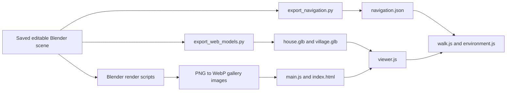

# SmallVillage — developer handoff

Prepared 3 October 2026. Application baseline: **`7854f60`** on `main`.

- Repository: <https://github.com/mendal2377-droid/SmallVillage>
- Production: <https://small-village-eta.vercel.app/>
- Owner's checkout: `D:/blender/test0910/SmallVillage`
- Start by reading this document, then `docs/PHOTO_RECONSTRUCTION.md` and `docs/photo-validation.json`.

## 1. What is implemented

SmallVillage presents an editable Blender reconstruction of a courtyard house and its village in Henan, China. The browser is a static Vite application using Three.js; there is no application backend, database, account system or required runtime secret.

| Feature | Current behavior |
| --- | --- |
| Gallery | 17 rendered views, including rooms, stairs, terrace, village plan and seasonal fields |
| 3D scenes | A detailed house and a full village containing that same house |
| Navigation | Orbit presets, full-screen first-person walking, keyboard/mouse and mobile touch controls |
| House access | Walk from the village lane through the red pedestrian gate, into the courtyard and rooms |
| Upstairs | Climb two stair flights and the turning landing; walk the corridor and upper rooms; exit through the green door onto the roof terrace |
| Collision | Height-aware walls/furniture, stair ramps, protected balcony/terrace edges, water barriers and bridge crossings |
| Seasons | Spring low green crops, summer green tall corn, autumn dry corn, winter snow and bare poplars |
| Weather | Clear, overcast, rain, snowfall and sunset; sky/light/fog changes and precipitation particles |
| Immersion | Page panels and orbit controls hidden while walking; small Menu/Exit buttons; hints fade; touch pad appears on touch devices |
| Wayfinding | House ring/label in the village orbit view, Find your house button and five village starting points |

The supplied sketch controls roads, waterways, two ponds, fields and the school. The house is at the user's **star**, in the lower-right housing strip, below the east-west stream and just west of the east perimeter road. The current scene has 184 estimated surrounding parcels and 237 poplars.

### Preserve these user decisions

- Keep the Chinese village name removed from the page's village heading. The English location remains.
- Follow the supplied house photos/videos; clear temporary clutter from the house reconstruction.
- Preserve the quiet, focused walking interface and usable mobile controls.
- Keep continuous village-to-house-to-upstairs-to-terrace access.
- Treat the star as the confirmed house location. North at the top is an assumption consistent with the satellite reference.
- Distinguish observed features from estimated dimensions, neighboring plots, school details and concealed rooms. This is a visual reconstruction, not a survey.
- Raw source media remains outside the public repository. Obtain it from the owner when needed.

## 2. Start development

Use Node.js **22.12+ or 24+**, npm and Git. The working machine uses Node 24. Dependency versions are resolved in `package-lock.json`; use `npm ci`.

```sh
git clone https://github.com/mendal2377-droid/SmallVillage.git
cd SmallVillage
npm ci
npm run dev -- --port 4173 --strictPort
```

Open <http://127.0.0.1:4173/>. Most browser tests assume this port. To inspect the application baseline exactly, use `git show 7854f60` or create a development branch from that commit. For ongoing work, branch from current `main`, which also contains this handoff.

```sh
npm run build
npm run preview -- --port 4173 --strictPort
```

Stop the dev server before previewing on the same port. `dist/` is generated and ignored.

Blender **5.1.2** was used for the saved scene and exports. Blender is only required for geometry, export or gallery work. Standalone Python with Pillow is needed to convert rendered PNGs to WebP. FFmpeg/ffprobe are useful for inspecting source videos, but are not required by the website.

## 3. Architecture and file map



| File | Responsibility / when to edit |
| --- | --- |
| `index.html` | Page, gallery buttons, scene selection and environment/walk menus |
| `src/main.js` | UI state, lazy viewer loading, gallery switching, menu pause/resume, immersive page state |
| `src/style.css` | Layout, responsive styles, full-viewport walking, minimal toolbar and touch controls |
| `src/viewer.js` | Renderer, camera presets, cached GLB loading, season visibility, highlight marker, animation loop |
| `src/walk.js` | Grounded camera, movement, mouse/touch look, collisions, stair height selection and water/bridge rules |
| `src/environment.js` | Sky gradient, lighting/fog, rain/snow particles, roof shelter and wet exterior materials |
| `public/models/` | Generated GLBs, navigation JSON and model statistics |
| `public/images/` | 17 published WebP gallery assets |
| `public/draco/` | Locally served decoder files and their license |
| `blender/video_revision/Yanlaozhai_Video_House_and_Lane.blend` | **Authoritative current source**, including the full rebuilt village |
| `blender/Yanlaozhai_Henan_Village.blend` | Original interpretive village, retained for history |
| `blender/rebuild_village_from_photos.py` | Procedural village construction and sketch coordinate mapping; historical rebuild inputs described below |
| `blender/video_revision/refine_roof_from_photos.py` | House/terrace corrections applied after the village rebuild |
| `blender/photo_village_inventory.json` | Estimated parcel inventory, landmarks, placement assumptions and village navigation configuration |
| `scripts/export_web_models.py` | Both material-batched, Draco-compressed GLB exports |
| `scripts/export_navigation.py` | Collision boxes, floor/stair surfaces, shelter footprints and scene configuration |
| `blender/render_photo_village.py` | Latest village, courtyard, kitchen, corridor and terrace gallery views |
| `blender/video_revision/render_interiors.py` | Other interior views; supports a list of requested view names |
| `scripts/finish_photo_assets.py` | Latest render PNGs to published WebPs |
| `docs/PHOTO_RECONSTRUCTION.md` | Evidence, interpretation and latest feature scope |
| `docs/photo-validation.json` | Saved successful checks and exact export sizes |
| `vercel.json` | Static build, output directory and response headers |

`createViewer(host)` provides `load`, `preset`, `setSeason`, `setWeather`, `walkAt`, `pauseWalk`, `walkInput`, `reset`, `setActive` and `exitWalk`. A `navigationchange` event communicates walking state back to `main.js`.

## 4. Blender editing and export workflow

**Open the current saved scene and develop from it.** Make a versioned copy before geometry work. Existing rebuild scripts contain local backup assumptions and can replace later revisions; they are not a single safe “rebuild everything” command.

Collections:

- `VIDEO 00`: filmed house architecture.
- `VIDEO 01`: brick alley and neighboring walls.
- `VIDEO 02`: former courtyard props; most temporary clutter was removed.
- `VIDEO 03`: ivy and permanent planting details.
- `VIDEO 04`: house reference cameras and interior lights.
- `VIDEO 05`: clean rooms, stairs, corridor and roof refinements.
- `MAP` collections: fields/crops, roads/bridges, waterways, residential blocks, poplars, primary school, village cameras.

The browser's house export includes all `VIDEO` collections. Its collision export currently selects `VIDEO 00`, `VIDEO 01` and `VIDEO 05`. Put new walkable structure in a selected collection or extend the exporter explicitly.

### Refresh the browser after a geometry change

Run from the repository root with `blender` on PATH:

```sh
blender --background --threads 4 --python scripts/export_navigation.py
blender --background --threads 4 --python scripts/export_web_models.py
npm run test:stairs
npm run test:environment
npm run build
```

On the owner's machine, the Blender executable is `D:/soft/blender/blender.exe`. In PowerShell, invoke a quoted executable with `&`.

Export updates `public/models/house.glb`, `village.glb`, `navigation.json` and `manifest.json`. Commit them together with the changed `.blend`. The export scripts read the saved file; unsaved edits in an interactive Blender session are not included. Finish saving before exports and avoid concurrent writers to the same `.blend`.

### Refresh rendered views

```sh
blender --background --threads 4 --python blender/render_photo_village.py
python scripts/finish_photo_assets.py
```

For a smaller render batch:

```sh
blender --background --threads 4 --python blender/render_photo_village.py -- kitchen upstairs terrace
```

The render output is the sibling directory `../village_reference/renders`, which the script creates. The converter publishes every PNG in that directory into `public/images/`; review the files there so an old render does not overwrite a newer asset.

For meeting/bedroom/storage/stairs, use `blender/video_revision/render_interiors.py -- meeting bedroom storage stairs`. Create `../interior_reference/renders` first on a fresh checkout; that script assumes its parent exists. Convert those PNGs with Pillow into the matching `public/images/*.webp` names. Use the latest photo render script for `upstairs` so the gallery retains the corrected corridor camera.

`scripts/prepare_images.py` refers to an older sibling `yanlaozhai` folder and is historical. `scripts/compress_models.py` is also historical: the current exporter already compresses GLBs and preserves season extras. Do not run the separate compression pass on current seasonal exports without reviewing its handling of extras.

### Asset cache versions

Model/navigation fetches use `sceneVersion` in `src/viewer.js`; image versions occur in `src/main.js` and `index.html`. Update the relevant versions when replacing assets. Model responses have a one-day cache header. A developer's local page can also retain a loaded GLB in the viewer's cache; refresh the page after replacing it.

## 5. Coordinates and data contracts

Scene units are treated as metres. Blender is Z-up; the browser is Y-up:

```text
browser X = Blender X - export offset X
browser Y = Blender Z - export offset Z
browser Z = -(Blender Y - export offset Y)
```

| Anchor | Value |
| --- | --- |
| House construction origin, Blender world | `(-37, -109, 0.12)` |
| House-only GLB export offset | `(-32, -109, 0)` |
| Village GLB offset | `(0, 0, 0)` |
| Village house focus target, browser | `(-31, 0, 108)` |
| House-lane starting point, browser | `(-38.7, 1.75, 122.5)` |
| Camera eye height above floor | `1.65` |
| Upstairs/terrace walk floor, world | `3.74` |
| Upstairs standing camera height | `5.39` |

The narrow gate's **pedestrian opening** is the usable entrance, beside the fixed large leaf. The tested lane route approaches browser `z = 112.65`, then crosses toward the courtyard. Aim at the opening rather than the centre of the full gate.

### Navigation JSON

`public/models/navigation.json` has `house` and `village` configurations:

- `boxes`: `[centerX, centerZ, halfX, halfZ, rotationRadians, lowY, highY]` for oriented collision boxes.
- `surfaces`: `{rect: [x0,z0,x1,z1], height, rise, axis}` for floors and ramps; height is the ramp start at its lower coordinate.
- `ground`, `bounds`, `spawn`, optional `yaw`.
- `shelters`: `{rect: [x0,z0,x1,z1], roof}`; precipitation stops when the camera is inside the footprint and below its roof.
- Village `waterZones`: rectangles or ellipses, plus `bridges` that allow crossing.
- Village `places`: `home`, `fields`, `avenue`, `pond`, `school`; each supplies a spawn and yaw.

The `.blend` scene stores JSON in `walk_surfaces`, `walk_shelters` and `village_navigation`. House surfaces/shelters are stored relative to the construction origin in Blender X/Y; the exporter converts them. Update these properties when moving floors, doors, stairs, roofs, waterways or starting points.

The collision exporter uses structural cuboids with **8 mesh vertices / 6 polygons**, orientation and vertical bounds. `walk_solid=False` explicitly excludes decorative geometry; `True` includes eligible small cuboids. Arbitrary sculpted/curved meshes do not automatically become colliders: add cuboid proxies and validate them. The current surface exporter handles the Y-aligned stair ramps by converting them to browser Z ramps; rotated or X-aligned ramps need an exporter extension.

Movement uses a `0.16` m camera footprint, `0.26` m maximum reachable step, axis-separated sliding and small movement substeps. Walking speed is `2` m/s or `3.8` with Shift. This is a navigation controller, not a rigid-body physics engine; it has no jump or free fall.

### Seasons and material batching

Blender object property `season` survives export as GLB extras / Three.js `userData.season`. Current tags are `green`, `corn`, `winter`, `leaves`. The web selector values are `green`, `summer`, `corn`, `winter`. Summer reuses the corn geometry with green material colors; restore the saved autumn colors when leaving summer. Winter hides leaves.

Keep batches separated by **season plus material**. The exporter simplifies procedural materials to colors, roughness, metallic and IOR, with special handling for clear balcony panes. Rendered images retain more Blender material detail. Object identity is mostly lost in material batches: per-building picking, opening individual doors or editing furniture at runtime will need separate logical identifiers or a revised export strategy.

Wetness currently identifies exterior materials by name in `environment.js`. If you rename or introduce materials, review that selection so ceilings and indoor furniture stay dry.

## 6. Testing and evidence

Browser scripts use installed Microsoft Edge (`channel: 'msedge'`) and software WebGL. Install Edge on the development machine, or deliberately adapt the launch configuration consistently for another Playwright browser. Browser tests require a running server; pure controller/environment tests do not.

```sh
# Without a server
npm run test:stairs
npm run test:environment

# With the dev/preview server on port 4173, run sequentially
npm test
npm run test:walk
npm run test:village
```

To check a deployment from PowerShell:

```powershell
$env:BASE_URL = 'https://small-village-eta.vercel.app'
npm run test:village
Remove-Item Env:BASE_URL
```

The browser suites write screenshots and JSON into ignored `test-results/`. The village suite checks all 17 gallery images, seasonal geometry, highlight, the continuous keyboard route to the roof, indoor precipitation, rain/snow, sunset, paused menu, exit and real touch input.

Evidence saved for the application baseline:

- Build, controller/stair and environment checks passed.
- Local browser smoke and walking suites passed.
- Production village browser suite passed, including mobile movement/look and village-to-terrace access.
- Model sizes: house **821,668 bytes / 96,369 triangles / 59 meshes**; village **2,856,232 bytes / 399,508 triangles / 83 meshes**.
- Navigation: house 223 obstacles / 10 surfaces / 3 shelters; village 1,394 obstacles / 10 surfaces / 234 shelters.

`docs/photo-validation.json` records the prior run; it is not a new test run whenever you open the file. `scripts/save_photo_validation.py` aggregates existing successful JSON files, has a fixed revision/date, and does not run tests. Update those fields and record new controller/environment results explicitly for a new release.

Software WebGL can be slow at a large viewport. A production keyboard test originally timed out while progressing down the lane; the navigation data matched and there was no obstacle at that position. The village suite now uses a 1024×700 desktop viewport and 120-second movement waits. Distinguish slow rendering from a reproducible collision failure. Avoid editing assets during a browser run: Vite reloads can abort navigation or reset the camera.

## 7. Deployment and access

GitHub `main` is connected to Vercel production. The observed deployment path is push to `main` → Vite build → publish `dist/` → production alias. Current `vercel.json` declares `npm run build` and `dist`.

Vercel project: **`small-village`**, in scope **`mendal2377-2948s-projects`**. New collaborators need GitHub write access to contribute/publish and Vercel team access to inspect/manage deployments. Authenticate with their own account; obtain invitations from the owner. Local ignored `.env*` and `.vercel/` files are not a portable authentication method.

On the owner's machine only, GitHub pushes used a local proxy:

```sh
git -c http.proxy=http://127.0.0.1:7890 -c http.version=HTTP/1.1 push origin main
```

Use normal Git networking elsewhere unless the environment requires that proxy. Vercel CLI, when authenticated, can inspect releases with `vercel ls small-village`. Confirm the new deployment is Ready and check the production alias before claiming a release is live.

## 8. Reference media and historical backups

The reference folders have been reorganized since earlier scripts/notes were written. **Current paths, verified while preparing this handoff:**

| Current owner-local path | Contents |
| --- | --- |
| `D:/blender/hometown/house/` | House photographs, screenshots of model errors and all three source videos |
| `.../house/a7052683d1582cdbe0d08dca263a9642_raw.mp4` | Original courtyard/alley recording, approximately 54.5 s |
| `.../house/20261003085305.mp4` | Interior and upstairs recording, approximately 116.5 s |
| `.../house/balcony.mp4` | Roof terrace recording, approximately 42.37 s |
| `D:/blender/hometown/village photos/` | 17 village/field photos and `map.png` satellite screenshot |
| `D:/blender/hometown/village plan.pptx` | Owner-supplied plan deck; inspect against the confirmed star position if using it |

Older documents mention `hometown/roof`, `hometown/photos` and videos directly under `hometown`; use the current locations above. The slide deck's internal contents were not inspected during this handoff. The confirmed star position comes from the user's sketch screenshot and is recorded in the current scene and inventory.

Generated contact sheets, frames, renders and backups are also outside the repository:

- `D:/blender/test0910/interior_reference/`, including `before_interiors.blend`.
- `D:/blender/test0910/village_reference/`, including `before_village_update.blend` and latest render PNGs.
- `D:/blender/test0910/roof_reference/`, including `before_roof_update.blend` and the balcony contact sheet.

Ask the owner for these if conducting evidence-based refinements or replaying historical rebuilds. A normal clone already contains the final `.blend`, GLBs and gallery, so it can run and be edited without them.

### Historical rebuild order and risks

1. `rebuild_from_video.py`: reconstruct the first filmed exterior from the original village.
2. `rebuild_interiors.py`: opens `../interior_reference/before_interiors.blend`; replaces house interiors/stairs. Earlier README guidance identifies `a23b855` as the pre-interior revision.
3. `rebuild_village_from_photos.py`: opens `../village_reference/before_village_update.blend`; replaces non-VIDEO objects and creates the MAP village.
4. `refine_roof_from_photos.py`: opens `../roof_reference/before_roof_update.blend`; applies the later house corrections and terrace surface.

These scripts create a backup from the current source when their expected backup is missing. On a fresh clone, that source is already the final revision, so blindly running them can duplicate additions or rebase a stage on the wrong input. The local historical backups are the correct stage inputs. For future work, use the saved final scene or create a new explicitly based refinement script; do not replay the chain without understanding each input/output.

## 9. Known limitations and sensible next work

All requested features in the application baseline are implemented. These are development opportunities, not unfulfilled promises:

- Village distances and parcels are estimated; orientation is assumed. A measured/georeferenced plan would improve accuracy.
- Most neighboring houses are procedural exterior blocks; they do not have the detailed, enterable interior of the owner's house. Upper rooms in the detailed house remain sparsely furnished because footage is incomplete.
- Weather is visual. Roof shelter uses camera/footprint tests, not per-particle roof collision; there is no physical accumulation, seasonal time progression, weather API or wind simulation.
- Summer recolors existing corn geometry. The saved Blender variants/render helper use three crop states; a dedicated summer asset/render would make the pipeline more explicit.
- Browser materials simplify Blender shaders. Baked textures, spatial batching/LOD and a mobile quality option could improve appearance/performance.
- The viewer lacks a full dispose lifecycle and accessibility work beyond keyboard controls/menu labels. Test repeated scene entry, resize, pointer lock and touch when changing navigation.
- The regeneration pipeline depends on sibling folders and stage backups. A parameterized, portable pipeline with explicit inputs and output paths is a useful first maintenance task.
- There is no app backend or automated repository CI workflow. Existing validation runs through local scripts.

### Before shipping a change

1. State the feature and any reconstruction assumptions.
2. Edit the saved scene/code; update floors, proxies, shelter, markers and spawns together if their coordinates change.
3. Refresh both geometry and navigation assets, gallery and cache versions as needed.
4. Run the relevant controller/environment/browser checks and build; inspect screenshots of the changed view.
5. Commit editable source plus generated assets and notes; push through the repository's agreed review process.
6. Confirm Vercel readiness and exercise the changed behavior on production.

## 10. Copyable brief for the next developer or coding agent

> Continue SmallVillage from current `main`; application baseline is `7854f60`. Read `HANDOFF.md`, `docs/PHOTO_RECONSTRUCTION.md` and `docs/photo-validation.json`. The authoritative geometry is `blender/video_revision/Yanlaozhai_Video_House_and_Lane.blend`, which already includes the detailed house and MAP village. Preserve the user's starred house position, clean interiors, immersive walking, mobile controls and continuous village → gate → rooms → stairs → terrace access. Raw references are now in `D:/blender/hometown/house` and `D:/blender/hometown/village photos` on the owner's machine. Treat dimensions/neighboring plots as estimates. Do not blindly rerun historical rebuild scripts; they open local stage backups. After geometry changes, export GLBs and navigation together, refresh cache versions and run the relevant tests/build. Vercel production is linked to GitHub main. Obtain collaborator access from the owner. Implement the new task: [describe the requested change here].
