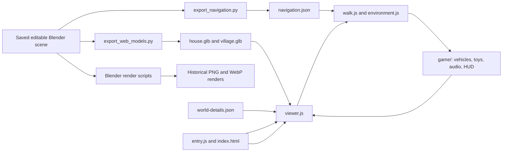

# SmallVillage — developer handoff

Latest landscape refinement: [docs/FOREST_PONDS.md](docs/FOREST_PONDS.md) covers clear gravel beds, 48 koi, lilies/frogs, mossy stone banks, the protected cove bridge, pavilion and seasonal cascade. Keep rendered bridge deck heights aligned with shared navigation ramps.

Latest input fix: [docs/WEAPON_AIM.md](docs/WEAPON_AIM.md) covers cursor-based toy aiming, a visible reticle, held-trigger steering and centred touch/pointer-lock aim. Preserve drag-to-look without accidental shots.

Latest addition: [docs/COAST_AND_FIREWORKS.md](docs/COAST_AND_FIREWORKS.md) covers the connected fictional coast, shared curved sea boundary, seventh map pin and harmless pooled firework Gatling (5; hold P/right mouse/touch trigger). Keep distant trees out of the ocean when changing the map bounds.

Latest follow-up: [docs/COMFORT_UPDATE.md](docs/COMFORT_UPDATE.md) covers smoother upstairs movement, adjustable drag look, the photo-based sunset and storage door, a persistent flight chicken, and activity markers/entry on the plan. Keep the separate door materials and runtime collider aligned when exporting the house.

Updated 4 October 2026. **Current application: illustrated wandering village on `main`.** Read [docs/PAINTED_WOODLAND.md](docs/PAINTED_WOODLAND.md) for the imagegen artwork, flower paths and connected forest lakes. Read [docs/ILLUSTRATION.md](docs/ILLUSTRATION.md) for the current painted visual direction, mixed woodland, grassy banks, smoke and night lighting. [docs/ROAD_REPAIR.md](docs/ROAD_REPAIR.md) documents level roads, safe planting and pond life; [docs/WANDERING.md](docs/WANDERING.md) covers map entry, energy and activities. [docs/CONNECTED_WORLD.md](docs/CONNECTED_WORLD.md) retains the earlier roofscape/navigation/export contracts; its two-button entry and animal counts are historical. Earlier photo/play baseline: `065ea71`.

- Repository: <https://github.com/mendal2377-droid/SmallVillage>
- Production: <https://small-village-eta.vercel.app/>
- Owner's checkout: `D:/blender/test0910/SmallVillage`
- Start by reading this document, then `docs/PHOTO_RECONSTRUCTION.md` and `docs/photo-validation.json`.

## 1. What is implemented

SmallVillage presents an editable Blender reconstruction of a courtyard house and its village in Henan, China. The browser is a static Vite application using Three.js; there is no application backend, database, account system or required runtime secret.

| Feature | Current behavior |
| --- | --- |
| Entry | Interactive 3D village plan, seven projected wandering pins including the yard and coast; Summer night preset; no gallery/story |
| 3D world | All entry points load the same full village containing the detailed house |
| Visual direction | Imagegen foliage, meadow and ground artwork; fine depth outlines and warmer directional lighting; existing house shape/map retained |
| Forest destination | 330 mixed trees, two large ponds, connected flower trails and a sixth overview pin; browser-created landscape/nav layer |
| Village atmosphere | Grassy banks, intermittent neighbour chimney smoke, warm window and yard lights after dusk |
| Navigation | Continuous full-screen walking; keyboard/mouse and mobile touch controls |
| House access | Walk from the village lane through the red pedestrian gate, into the courtyard and rooms |
| Upstairs | Climb two stair flights and the turning landing; walk the corridor and upper rooms; exit through the green door onto the roof terrace |
| Collision | Height-aware walls/furniture, stair ramps, protected balcony/terrace edges, water barriers and bridge crossings |
| Seasons | Uneven wheat/maize, curved mixed vegetable beds, melon vines, fruit trees, mature spreading trees, winter seedlings/resting beds/bare crowns |
| Weather and time | Clear, overcast, rain, thunderstorm (lightning and thunder), snowfall, fog and sunset; a day/night cycle with sun, moon and stars, optional time progression |
| Play | Vehicles/toys/chicken flight retained; fishing, potato roasting, watermelon picking, rabbit chasing, kite flying, night fireworks |
| Water / sky | Light green flowing water, five swimming fish types, 37 hopping pond frogs, water grass/cattails/duckweed/dragonflies, soft banks/lotus; twinkling stars and summer fireflies |
| Immersion | Quiet HUD; score appears after target hits; weather/season controls in walk mode; hints fade |
| Wayfinding | Expandable north-up minimap, player/home/destination and direction/distance; house beacon when farther than 45 m |
| Energy | Time-based drain, 25% warning, physical home recovery, activity pause/rewards; no forced immobilisation |

The supplied sketch controls roads, waterways, two ponds, fields and the school. The house is at the user's **star**, in the lower-right housing strip, below the east-west stream and just west of the east perimeter road. The former 184-parcel inventory is historical: the immediate neighbors were replaced with photo-based roof silhouettes. There are still 237 mapped poplars; the browser now adds 330 navigable woodland trees and two large lakes east of the fields, using an additive navigation layer; three were relocated away from bridge approaches. The browser adds 37 spreading/fruit trees, including 20 orchard trees. Ground-level roads and bridge decks have continuous level paving, with the former 637 raised joint bars removed.

### Preserve these user decisions

- The game is playful and non-lethal: slingshot, water pistol, firecrackers and snowballs act on tins, bottles, straw targets and scatter-and-return sparrows. Vehicles are the e-trike (from the courtyard photos) and a farm tractor.
- Production deploys from `main` (the owner asked for direct pushes to `main`).
- Keep the Chinese village name removed from the page's village heading. The English location remains.
- Follow the supplied house photos/videos; clear temporary clutter from the house reconstruction.
- The latest art reference supersedes the goal of matching real surface appearance: use an illustrated village while retaining the current house shape and connected map. Preserve grassy banks, varied distant trees, occasional smoke and warm night lights including the owner's yard.
- Preserve the quiet, focused walking interface and usable mobile controls.
- Use the actual 3D village plan with wandering pins as the entry; every pin uses the full world. Chicken flight, energy, six activities and the Summer night preset are explicitly requested gameplay. G/J change weather/season during walking.
- Keep continuous village-to-house-to-upstairs-to-terrace access.
- Treat the star as the confirmed house location. North at the top is an assumption consistent with the satellite reference.
- Distinguish observed features from estimated dimensions, neighboring plots, school details and concealed rooms. This is a visual reconstruction, not a survey.
- Raw source media remains outside the public repository. Obtain it from the owner when needed.

## 2. Start development

Use Node.js **22.12+ or 24+**, npm and Git. The working machine uses Node 24. Dependency versions are resolved in `package-lock.json`; use `npm ci`.

```sh
git clone https://github.com/mendal2377-droid/SmallVillage.git
cd SmallVillage
npm ci
npm run dev -- --port 4173 --strictPort
```

Open <http://127.0.0.1:4173/>. Current tests use this port. Branch from current `main`; `065ea71` is only the historical pre-connected-world baseline.

```sh
npm run build
npm run preview -- --port 4173 --strictPort
```

Stop the dev server before previewing on the same port. `dist/` is generated and ignored.

Blender **5.1.2** was used for the saved scene and exports. Blender is only required for geometry, export or gallery work. Standalone Python with Pillow is needed to convert rendered PNGs to WebP. FFmpeg/ffprobe are useful for inspecting source videos, but are not required by the website.

## 3. Architecture and file map



| File | Responsibility / when to edit |
| --- | --- |
| `index.html` | Projected 3D map entry, minimap/energy/activity HUD and environment/tools menu |
| `src/entry.js` | Startup overview loading, map-pin entry spawn, settings, menu, keyboard/touch UI |
| `src/world.css` | Full-viewport layout, quiet HUD and mobile controls |
| `src/world.js` | Surface textures, crop/leaf instancing, wind and water shader |
| `src/illustration.js` | Shared colour/depth rendering pass, fine ink contours, painted architecture palette and paper surface |
| `src/atmosphere.js` | Mixed distant forest, grassy bank surfaces, chimney smoke, actual-window glow and yard lighting |
| `src/planting.js` | Shared road/bridge/water/building exclusion rules and safe tree relocation |
| `src/wetland.js` | Pond frogs and hop ripples, submerged grass, cattails, duckweed and dragonflies |
| `src/game/creatures.js` | Animal anatomy/gaits, roaming, chicken holding/flight/landing |
| `public/models/world-details.json` | Blender tree positions and field rectangles for dynamic vegetation |
| `blender/upgrade_connected_world.py` | Current-source near roofscape refinement and metadata export |
| `blender/repair_roads_and_planting.py` | Current-source paving repair, complete poplar relocation, road-footprint metadata and audit |
| `src/viewer.js` | Renderer, camera presets, cached GLB loading, season visibility, highlight marker, animation loop |
| `src/walk.js` | Grounded camera, movement, mouse/touch look, collisions, stair height selection and water/bridge rules |
| `src/environment.js` | Time of day, sky gradient/stars/sun/moon, lighting/fog, rain/snow particles, lightning, roof shelter and wet exterior materials |
| `src/game/game.js` | Play layer: keys, HUD, flashlight, ambience; started/stopped with walking |
| `src/game/vehicles.js` | Procedural e-trike and tractor, parking spots per scene, driving physics, chase/seat camera, headlights |
| `src/game/toys.js` | Toys, projectiles, tins/bottles, straw targets, sparrows and per-scene target layouts |
| `src/game/audio.js` | Web Audio synthesis; no audio files |
| `public/models/` | Generated GLBs, navigation JSON and model statistics |
| `public/images/` | Historical WebP renders; no longer loaded by the page |
| `public/draco/` | Locally served decoder files and their license |
| `blender/video_revision/Yanlaozhai_Video_House_and_Lane.blend` | **Authoritative current source**, including the full rebuilt village |
| `blender/Yanlaozhai_Henan_Village.blend` | Original interpretive village, retained for history |
| `blender/rebuild_village_from_photos.py` | Procedural village construction and sketch coordinate mapping; historical rebuild inputs described below |
| `blender/video_revision/refine_roof_from_photos.py` | House/terrace corrections applied after the village rebuild |
| `blender/video_revision/refine_house_details.py` | 3 Oct photo corrections (curtains, stove, sink, brick floor, façade bands, upper east window). Re-runnable: starts from `../house_detail_reference/before_house_details.blend` |
| `blender/photo_village_inventory.json` | Estimated parcel inventory, landmarks, placement assumptions and village navigation configuration |
| `scripts/export_web_models.py` | Both material-batched, Draco-compressed GLB exports |
| `scripts/export_navigation.py` | Collision boxes, floor/stair surfaces, shelter footprints and scene configuration |
| `scripts/export_atmosphere.py` | Reads current saved scene; exports window bounding boxes without changing geometry |
| `public/models/atmosphere.json` | Actual window centres/sizes and detailed-house flag for the illustrated lighting layer |
| `blender/render_photo_village.py` | Latest village, courtyard, kitchen, corridor and terrace gallery views |
| `blender/video_revision/render_interiors.py` | Other interior views; supports a list of requested view names |
| `scripts/finish_photo_assets.py` | Latest render PNGs to published WebPs |
| `docs/PHOTO_RECONSTRUCTION.md` | Evidence, interpretation and latest feature scope |
| `docs/photo-validation.json` | Saved successful checks and exact export sizes |
| `vercel.json` | Static build, output directory and response headers |

`createViewer(host, {onEnter})` provides `load`, `preset`, `setSeason`, `setWeather`, `walkAt`, `pauseWalk`, `walkInput`, `reset`, `setActive` and `exitWalk`. `entry.js` loads the full village at startup for the overview. Projected map pins select the starting place. A `navigationchange` event communicates walking state back to `entry.js`.

## 4. Blender editing and export workflow

**Open the current saved scene and develop from it.** Make a versioned copy before geometry work. Existing rebuild scripts contain local backup assumptions and can replace later revisions; they are not a single safe “rebuild everything” command.

Collections:

- `VIDEO 00`: filmed house architecture.
- `VIDEO 01`: brick alley and neighboring walls.
- `VIDEO 02`: former courtyard props; most temporary clutter was removed.
- `VIDEO 03`: ivy and permanent planting details.
- `VIDEO 04`: house reference cameras and interior lights.
- `VIDEO 05`: clean rooms, stairs, corridor and roof refinements.
- `MAP` collections: fields/crops, roads/bridges, waterways, residential blocks, poplars, primary school, village cameras.

The browser's house export includes all `VIDEO` collections. Its collision export currently selects `VIDEO 00`, `VIDEO 01` and `VIDEO 05`. Put new walkable structure in a selected collection or extend the exporter explicitly.

### Refresh the browser after a geometry change

Run from the repository root with `blender` on PATH:

```sh
blender --background --threads 4 --python scripts/export_navigation.py
blender --background --threads 4 --python scripts/export_web_models.py
blender --background --threads 4 --python scripts/export_atmosphere.py
npm run test:stairs
npm run test:environment
npm run build
```

On the owner's machine, the Blender executable is `D:/soft/blender/blender.exe`. In PowerShell, invoke a quoted executable with `&`.

Export updates `public/models/house.glb`, `village.glb`, `navigation.json` and `manifest.json`. Commit them together with the changed `.blend`. The export scripts read the saved file; unsaved edits in an interactive Blender session are not included. Finish saving before exports and avoid concurrent writers to the same `.blend`.

### Refresh rendered views

```sh
blender --background --threads 4 --python blender/render_photo_village.py
python scripts/finish_photo_assets.py
```

For a smaller render batch:

```sh
blender --background --threads 4 --python blender/render_photo_village.py -- kitchen upstairs terrace
```

The render output is the sibling directory `../village_reference/renders`, which the script creates. The converter publishes every PNG in that directory into `public/images/`; review the files there so an old render does not overwrite a newer asset.

For meeting/bedroom/storage/stairs, use `blender/video_revision/render_interiors.py -- meeting bedroom storage stairs`. Create `../interior_reference/renders` first on a fresh checkout; that script assumes its parent exists. Convert those PNGs with Pillow into the matching `public/images/*.webp` names. Use the latest photo render script for `upstairs` so the gallery retains the corrected corridor camera.

`scripts/prepare_images.py` refers to an older sibling `yanlaozhai` folder and is historical. `scripts/compress_models.py` is also historical: the current exporter already compresses GLBs and preserves season extras. Do not run the separate compression pass on current seasonal exports without reviewing its handling of extras.

### Asset cache versions

Model/navigation/vegetation metadata fetches use `sceneVersion` in `src/viewer.js`. Update it when replacing assets. Model responses have a one-day cache header. A developer's local page can also retain a loaded GLB in the viewer's cache; refresh the page after replacing it. Gallery image versions are now historical.

## 5. Coordinates and data contracts

Scene units are treated as metres. Blender is Z-up; the browser is Y-up:

```text
browser X = Blender X - export offset X
browser Y = Blender Z - export offset Z
browser Z = -(Blender Y - export offset Y)
```

| Anchor | Value |
| --- | --- |
| House construction origin, Blender world | `(-37, -109, 0.12)` |
| House-only GLB export offset | `(-32, -109, 0)` |
| Village GLB offset | `(0, 0, 0)` |
| Village house focus target, browser | `(-31, 0, 108)` |
| House-lane starting point, browser | `(-38.7, 1.75, 122.5)` |
| Camera eye height above floor | `1.65` |
| Upstairs/terrace walk floor, world | `3.74` |
| Upstairs standing camera height | `5.39` |

The narrow gate's **pedestrian opening** is the usable entrance, beside the fixed large leaf. The tested lane route approaches browser `z = 112.65`, then crosses toward the courtyard. Aim at the opening rather than the centre of the full gate.

### Navigation JSON

`public/models/navigation.json` has `house` and `village` configurations:

- `boxes`: `[centerX, centerZ, halfX, halfZ, rotationRadians, lowY, highY]` for oriented collision boxes.
- `surfaces`: `{rect: [x0,z0,x1,z1], height, rise, axis}` for floors and ramps; height is the ramp start at its lower coordinate.
- `ground`, `bounds`, `spawn`, optional `yaw`.
- `shelters`: `{rect: [x0,z0,x1,z1], roof}`; precipitation stops when the camera is inside the footprint and below its roof.
- Village `waterZones`: rectangles or ellipses, plus `bridges` that allow crossing.
- Village `places`: `home`, `fields`, `avenue`, `pond`, `school`; each supplies a spawn and yaw.
- Village `roads`: `[centreX, centreZ, halfX, halfZ, rotationRadians]` paving footprints; mirrored in `world-details.json` for planting exclusion. Refresh with the current-source road repair before exporting changed road geometry.

The `.blend` scene stores JSON in `walk_surfaces`, `walk_shelters` and `village_navigation`. House surfaces/shelters are stored relative to the construction origin in Blender X/Y; the exporter converts them. Update these properties when moving floors, doors, stairs, roofs, waterways or starting points.

The collision exporter uses structural cuboids with **8 mesh vertices / 6 polygons**, orientation and vertical bounds. `walk_solid=False` explicitly excludes decorative geometry; `True` includes eligible small cuboids. Arbitrary sculpted/curved meshes do not automatically become colliders: add cuboid proxies and validate them. The current surface exporter handles the Y-aligned stair ramps by converting them to browser Z ramps; rotated or X-aligned ramps need an exporter extension.

Movement uses a `0.16` m camera footprint, `0.26` m maximum reachable step, axis-separated sliding and small movement substeps. Walking speed is `2` m/s or `3.8` with Shift. This is a navigation controller, not a rigid-body physics engine; it has no jump or free fall.

### Game layer contracts

- `walk.js` exposes `solidAt(x,z,low,high,r,skip)`, `floorAt`, `inWater`, `standAt`, `axis()` and `setDynamic(id,box)`. Vehicles and crates register oriented boxes in the exported box convention (`localX=c·dx−s·dz`, `localZ=s·dx+c·dz`) with an `owner` so a vehicle ignores itself.
- `walk.driving=true` hands movement and the camera to `vehicles.js`; mouse look still updates `walk.yaw/pitch`, which the chase camera uses as an orbit offset.
- Vehicle parking and target layouts are in `parking` (`vehicles.js`) and `LAYOUT` (`toys.js`). Village crates and straw targets are placed in front of each `places` spawn and nudged to the nearest clear spot. If you move the courtyard trike or crate, rerun `npm run test:walk`; the walk route passes close to them.
- Vehicle bodies may overhang water (narrow ditches beside field paths); the centre line may not, so streams are crossed only at `bridges`.
- Lights that are off are also `visible=false`; zero-intensity lights still cost per-pixel work and slowed the software-WebGL browser suite enough to time out.
- The sky dome writes colours without output conversion, so night/dusk tones in `environment.js` are chosen by how they display.
- In development only, `window.__viewer` exposes the scene, camera, walk controller, environment and game for inspection.

### Seasons and material batching

Blender object property `season` survives export as GLB extras / Three.js `userData.season`. Current tags are `green`, `corn`, `winter`, `leaves`. The web selector values are `green`, `summer`, `corn`, `winter`. Summer reuses the corn geometry with green material colors; restore the saved autumn colors when leaving summer. Winter hides leaves.

Keep batches separated by **season plus material**. The exporter simplifies procedural materials to colors, roughness, metallic and IOR, with special handling for clear balcony panes. Rendered images retain more Blender material detail. Object identity is mostly lost in material batches: per-building picking, opening individual doors or editing furniture at runtime will need separate logical identifiers or a revised export strategy.

Wetness currently identifies exterior materials by name in `environment.js`. If you rename or introduce materials, review that selection so ceilings and indoor furniture stay dry.

## 6. Testing and evidence

Browser scripts use installed Microsoft Edge (`channel: 'msedge'`) and software WebGL. Install Edge on the development machine, or deliberately adapt the launch configuration consistently for another Playwright browser. Browser tests require a running server; pure controller/environment tests do not.

```sh
# Without a server
npm run test:planting
npm run test:stairs
npm run test:environment
npm run test:game
npm run test:adventure

# With the dev/preview server on port 4173, run sequentially
npm test
npm run test:walk
npm run test:village
npm run test:touch
npm run test:activities   # Development server, uses development-only scene inspection
npm run test:ecology      # Development server: repaired roads/bridge, orchard, frog hop and seasons
npm run test:illustration # Dev or BASE_URL: painted world, forest/banks, smoke and day/night lights
```

To check a deployment from PowerShell:

```powershell
$env:BASE_URL = 'https://small-village-eta.vercel.app'
npm run test:village
Remove-Item Env:BASE_URL
```

**Current test commands supersede the historical gallery suites:** `npm test` / `test:village` run `world-browser.mjs`; `test:walk` runs `connected-test.mjs`; `test:adventure` covers energy and six activities; `test:touch` covers mobile entry/input. Stairs/environment/game checks remain current. New browser evidence is in ignored `artifacts/world/`. See README and WANDERING.md for exact coverage. Old gallery scripts do not match the new interface.

Wandering release checks, 4 Oct 2026: build, connected walking/chicken flight, stairs, environment, vehicle/toy controllers and all six adventure controllers passed. Desktop browser checks passed for 3D pins, minimap/energy, fishing, home recovery, live settings and renderer reuse. Phone touch checks passed for map expansion, arrows/look, winter tools and the walking Summer night preset. The additional activity browser check passed fishing, kite and night fireworks, plus garden/orchard/fish captures, with no JavaScript or shader errors. These are functional and visual checks of a procedural scene, not a claim of photo fidelity.

Road/wetland update: Blender repair and paired exports passed. Planting validation checked all 237 source poplars and eight bridge routes; connected walking and stairs passed again. The local ecology browser passed level roads, clear bridge, denser trees, actual frog movement and winter/summer visibility with no JavaScript or shader errors. Latest model counts: house 59 meshes / 97,569 triangles / 1,218,860 bytes; village 92 meshes / 410,080 triangles / 4,099,156 bytes. Navigation has 224 house and 1,397 village obstacles. See ROAD_REPAIR.md for scope and evidence.

Initial illustration update: the saved house/map geometry and base navigation were retained; art surfaces, crown masses, 667 distant trees, 34 bank segments, 21 decorative chimneys and day/night lighting were generated in the browser. The local illustration suite passed smoke movement, home lighting, winter/day changes and shader checks. This initial crown treatment is superseded by the imagegen artwork below.

Painted woodland update: the built-in imagegen tool produced an original concept board and three actual runtime textures (foliage, meadow, ground). Painted sprays replace the opaque crown spheres; roadside flower ribbons and 330 mixed woodland trees surround two new large ponds. The sixth overview pin starts on a clear forest trail, with a continuous route back to the yard. The augmented runtime navigation adds pond barriers, path footprints and trunk colliders while preserving the original GLBs and measured house. Build, woodland route/planting, connected walking/chicken flight, stairs, weather, vehicles/toys, energy/activities, desktop forest/season/night rendering, phone controls and illustration/night-house checks passed without JavaScript or shader errors. See PAINTED_WOODLAND.md and docs/design/IMAGEGEN.md for the source contract and exact prompts.

Historical evidence for baseline `065ea71` (run locally on 3 Oct 2026; sizes below precede UV/roofscape exports):

- `npm run test:stairs`, `test:environment` (now includes day/night, storm and fog) and `test:game` passed; `npm run build` succeeded (three.js chunk-size warning only).
- Local `npm test` and `npm run test:walk` passed. `test:village` passed on the local server for the play-layer commit; it was **not** re-run against production after the final push. Production was checked by hand: page served the new build, the house loaded, walking started the play layer (1 vehicle, 11 targets, HUD visible, no console errors).
- Model sizes: house **827,196 bytes / 97,569 triangles / 59 meshes**; village **2,861,832 bytes / 400,708 triangles / 83 meshes**.
- Navigation: house 224 obstacles / 10 surfaces / 3 shelters; village 1,395 obstacles / 10 surfaces / 234 shelters.
- `docs/photo-validation.json` still records the earlier `7854f60` run and was not regenerated.

`docs/photo-validation.json` records the prior run; it is not a new test run whenever you open the file. `scripts/save_photo_validation.py` aggregates existing successful JSON files, has a fixed revision/date, and does not run tests. Update those fields and record new controller/environment results explicitly for a new release.

Software WebGL can be slow at a large viewport. The current world suite uses 1000×650 and 180-second waits; activities use 760×500. Movement physics uses a capped step, while energy and activity timers use active elapsed time. Distinguish slow rendering from a reproducible collision failure. The walk suite once timed out after the play layer was added; the cause was always-on zero-intensity lights, fixed by `visible=false` (see game contracts). If a browser test starts timing out again, first look for new per-frame GPU work. Avoid editing assets during a browser run: Vite reloads can abort navigation or reset the camera.

## 7. Deployment and access

GitHub `main` is connected to Vercel production. The observed deployment path is push to `main` → Vite build → publish `dist/` → production alias. Current `vercel.json` declares `npm run build` and `dist`.

Vercel project: **`small-village`**, in scope **`mendal2377-2948s-projects`**. New collaborators need GitHub write access to contribute/publish and Vercel team access to inspect/manage deployments. Authenticate with their own account; obtain invitations from the owner. Local ignored `.env*` and `.vercel/` files are not a portable authentication method.

On the owner's machine only, GitHub pushes used a local proxy:

```sh
git -c http.proxy=http://127.0.0.1:7890 -c http.version=HTTP/1.1 push origin main
```

Use normal Git networking elsewhere unless the environment requires that proxy. Vercel CLI, when authenticated, can inspect releases with `vercel ls small-village`. Confirm the new deployment is Ready and check the production alias before claiming a release is live.

## 8. Reference media and historical backups

The reference folders have been reorganized since earlier scripts/notes were written. **Current paths, verified while preparing this handoff:**

| Current owner-local path | Contents |
| --- | --- |
| `D:/blender/hometown/house/` | House photographs, screenshots of model errors and all three source videos |
| `.../house/a7052683d1582cdbe0d08dca263a9642_raw.mp4` | Original courtyard/alley recording, approximately 54.5 s |
| `.../house/20261003085305.mp4` | Interior and upstairs recording, approximately 116.5 s |
| `.../house/balcony.mp4` | Roof terrace recording, approximately 42.37 s |
| `D:/blender/hometown/village photos/` | 17 village/field photos and `map.png` satellite screenshot |
| `D:/blender/hometown/village plan.pptx` | Owner-supplied plan deck; inspect against the confirmed star position if using it |

Older documents mention `hometown/roof`, `hometown/photos` and videos directly under `hometown`; use the current locations above. The slide deck's internal contents were not inspected during this handoff. The confirmed star position comes from the user's sketch screenshot and is recorded in the current scene and inventory.

Generated contact sheets, frames, renders and backups are also outside the repository:

- `D:/blender/test0910/interior_reference/`, including `before_interiors.blend`.
- `D:/blender/test0910/village_reference/`, including `before_village_update.blend` and latest render PNGs.
- `D:/blender/test0910/roof_reference/`, including `before_roof_update.blend` and the balcony contact sheet.

Ask the owner for these if conducting evidence-based refinements or replaying historical rebuilds. A normal clone already contains the final `.blend`, GLBs and gallery, so it can run and be edited without them.

### Historical rebuild order and risks

1. `rebuild_from_video.py`: reconstruct the first filmed exterior from the original village.
2. `rebuild_interiors.py`: opens `../interior_reference/before_interiors.blend`; replaces house interiors/stairs. Earlier README guidance identifies `a23b855` as the pre-interior revision.
3. `rebuild_village_from_photos.py`: opens `../village_reference/before_village_update.blend`; replaces non-VIDEO objects and creates the MAP village.
4. `refine_roof_from_photos.py`: opens `../roof_reference/before_roof_update.blend`; applies the later house corrections and terrace surface.

These scripts create a backup from the current source when their expected backup is missing. On a fresh clone, that source is already the final revision, so blindly running them can duplicate additions or rebase a stage on the wrong input. The local historical backups are the correct stage inputs. For future work, use the saved final scene or create a new explicitly based refinement script; do not replay the chain without understanding each input/output.

## 9. Known limitations and sensible next work

All requested features in the application baseline are implemented. These are development opportunities, not unfulfilled promises:

- **Open items from the 3 Oct photo review.** Photo-faithful geometry was corrected only where it was clearly wrong. Still approximate: the stove front (arches are flat dark panels), wardrobe/furniture proportions in the rooms, and the village-side neighbouring walls seen from the courtyard. Check new work against `D:/blender/hometown/house/*.jpg` next to the matching browser screenshot.
- Current art direction is in ILLUSTRATION.md; map/energy/activities/gardens/ecology/night are in WANDERING.md; earlier connected-world architecture and flight are in CONNECTED_WORLD.md. Future ideas: persistence, fuller route planning and footstep/indoor-outdoor audio.

- Village distances and parcels are estimated; orientation is assumed. A measured/georeferenced plan would improve accuracy.
- Most neighboring houses are procedural exterior blocks; they do not have the detailed, enterable interior of the owner's house. Upper rooms in the detailed house remain sparsely furnished because footage is incomplete.
- Weather is visual. Roof shelter uses camera/footprint tests, not per-particle roof collision; there is no physical accumulation, automatic season progression, weather API or wind simulation beyond slanted rain.
- Vehicles and toys are procedural Three.js meshes, not Blender assets. Vehicles collide with box proxies and floors, not with arbitrary meshes, and do not tilt on slopes. Targets reset rather than persist; there is no save game.
- Summer recolors existing corn geometry. The saved Blender variants/render helper use three crop states; a dedicated summer asset/render would make the pipeline more explicit.
- Browser surface textures, batching and crop distance detail now improve appearance/performance. A mobile quality selector and baked scanned materials remain useful future work.
- The viewer lacks a full dispose lifecycle and accessibility work beyond keyboard controls/menu labels. Test repeated scene entry, resize, pointer lock and touch when changing navigation.
- The regeneration pipeline depends on sibling folders and stage backups. A parameterized, portable pipeline with explicit inputs and output paths is a useful first maintenance task.
- There is no app backend or automated repository CI workflow. Existing validation runs through local scripts.

### Before shipping a change

1. State the feature and any reconstruction assumptions.
2. Edit the saved scene/code; update floors, proxies, shelter, markers and spawns together if their coordinates change.
3. Refresh geometry, navigation, world metadata and cache versions as needed. Gallery regeneration is no longer needed for the page.
4. Run the relevant controller/environment/browser checks and build; inspect screenshots of the changed view.
5. Commit editable source plus generated assets and notes; push through the repository's agreed review process.
6. Confirm Vercel readiness and exercise the changed behavior on production.

## 10. Copyable brief for the next developer or coding agent

> Continue SmallVillage from current main. Read HANDOFF.md, docs/WANDERING.md and docs/CONNECTED_WORLD.md first. The page is a 3D village plan with projected entry pins; every pin uses the full village model and continuous gate/rooms/stairs/terrace navigation. Preserve the starred house position, photo-based roofscape, clean interiors, quiet HUD/mobile controls, live weather/seasons, chicken flight, minimap/energy, location activities and Summer night preset. Shared coordinates are in src/places.js; activities/energy in src/game/adventure.js; garden/ecology geometry in src/gardens.js. Architecture is in blender/video_revision/Yanlaozhai_Video_House_and_Lane.blend. Raw media is in D:/blender/hometown/house and D:/blender/hometown/village photos outside Git. Dimensions/neighbors/new gardens/species are estimates or gameplay interpretations. Do not replay old backup scripts blindly. Export architecture/navigation/metadata together if changed; bump sceneVersion and run relevant tests including test:adventure, npm test, test:touch and build. Vercel deploys GitHub main; obtain collaborator access from the owner. Implement the new requested change: [describe it here].
