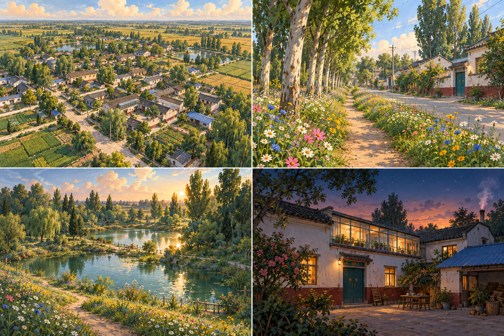

# Imagegen art direction and prompts

Generated with the built-in imagegen tool on 4 October 2026. These are original project assets, shipped locally. Alpha is preserved in both vegetation PNGs; the ground PNG is opaque. No external image service is used during play.

## Concept board

Final prompt:

Use case: stylized-concept. Asset type: environment art direction board for an interactive 3D village game, landscape wide. Re-imagine a rural Henan Chinese village as an immersive hand-painted illustrated world. Four coherent scenes in an elegant 2 by 2 board without text: bird's-eye village plan with existing rectangular courtyard houses and roads, an eye-level poplar avenue with a continuous wildflower footpath beside it, a tranquil mixed woodland with TWO large jade ponds and grassy sloping shores, and the familiar white two-storey Chinese courtyard with teal doors, burgundy lower walls, glass upstairs corridor and blue metal shed at summer dusk. Keep authentic Chinese village architecture and flat agricultural landscape, no European churches, windmills or mountains. Style: gouache and watercolor animation backgrounds, broken brush strokes, subtly inked silhouettes, foliage as overlapping irregular painted shapes rather than balloons or individual floating leaves. Dense lush meadow with white daisies, pink cosmos, blue cornflowers and golden flowers; varied willow, broadleaf, poplar and evergreen silhouettes. Soft green and teal shadows, warm cream sunlit walls, muted ochre paths, airy blue sky and painterly cream clouds. Warm low golden sunlight, atmospheric depth, gentle drifting pollen, pond glints. Night courtyard panel with amber lit windows and soft chimney smoke, blinking stars. Readable traversable paths, preserve home shape and connected village. No UI, labels, borders, text, logos, screenshot chrome.

## Painted canopy

Consumed by avenue poplars, orchard/shade trees, distant woods and the new accessible woodland. File: `public/textures/painted/foliage.png`.

Final prompt:

Use case: stylized-concept. Asset type: seamless-looking foliage cluster cutout texture for crossed 3D canopy cards in a hand-painted village game. A SINGLE dense irregular cluster of small overlapping deciduous leaves, filling the central 90 percent of a square image, surrounded by genuine transparent alpha. No trunk, sky, ground, pot, border or text. Hundreds of layered small brush-shaped leaves arranged in branching sprays, irregular feathered broken outline with small holes, NOT a circular bush, NOT a spherical balloon. Gouache animation background art, confidently painted strokes and subtly inked contour. Neutral light sage, olive and warm cream highlights, cool muted green shaded patches; medium-low contrast, no pure black. Illumination from upper left. Readable leaf groups from distance, detailed flecks close up. Transparent exterior and small gaps between sprays. This asset will be tinted seasonally and layered into organic tree shapes.

## Meadow clump

Consumed by roadside ribbons, the forest trail and pond glades. File: `public/textures/painted/meadow.png`.

Final prompt:

Use case: stylized-concept. Asset type: transparent game vegetation cutout, a single small wildflower meadow clump for crossed upright 3D cards. Genuine transparent background. Full plant visible from ground to flower tips, bottom aligned, roughly square composition. Dense tuft of thin curving green grasses and stems with white daisies, tiny butter-yellow blooms, dusty pink cosmos and several blue cornflowers, irregular heights. Flowers form upper third, stems and foliage lower two thirds. Hand-painted gouache illustration with watercolor broken edges and brush strokes, subtle ink accents, sage greens, warm cream highlights and soft teal shadows, animated storybook environment mood. Slight variation of flower sizes. No scenery, soil slab, pot, sky, shadow backdrop, text, labels or border. No photorealism. Alpha outside the tuft and between stems. Intended to plant in dense uneven ribbons along a village footpath, with warm evening light.

## Painted ground

Consumed by woodland ground, agricultural ground and grass banks. File: `public/textures/painted/ground.png`. World coordinates keep the brush marks consistently sized across different meshes.

Final prompt:

Use case: stylized-concept. Asset type: tileable ground albedo texture for a painted 3D village and woodland, square edge-to-edge. Overhead orthographic view of low meadow grass and moss. Small irregular gouache brush marks, sage and olive green grasses, warm cream dry grass flicks, muted teal small shadows, gentle broad watercolor wash variation. Fairly neutral light midtone so it can be tinted by seasons. No individual large flowers, no trees, no buildings, no objects, no perspective, no horizon, no vignette, no cast shadows, no text. Consistent detail and illumination all the way to every edge. Hand-painted animation-background illustration surface, neither photographic nor noisy procedural dots. Restrained contrast and soft patchy shapes, natural meadow texture with fine thin grass strokes.

## Translation into the game

The concept establishes the palette and density; it is not a literal image replacement of the world. Existing measured house silhouettes, rooms, gates, stairs, village streets and seasonal/game controls remain. Painted foliage cards overlap through three-dimensional crowns, replacing opaque stacked spheres. Amber night windows, smoke, water movement, fish, frogs, live weather and summer stars continue. The new forest uses five tree forms and two ponds (86 by 64 metres and 92 by 68 metres), with joined, flush paths and seasonal meadow edges.

Generated meadow flowers are a decorative illustration mix, not a botanical survey of Yanlaozhai. The new woodland and lakes are an imaginative addition east of the village; the reference sketch's existing waterways are retained.
